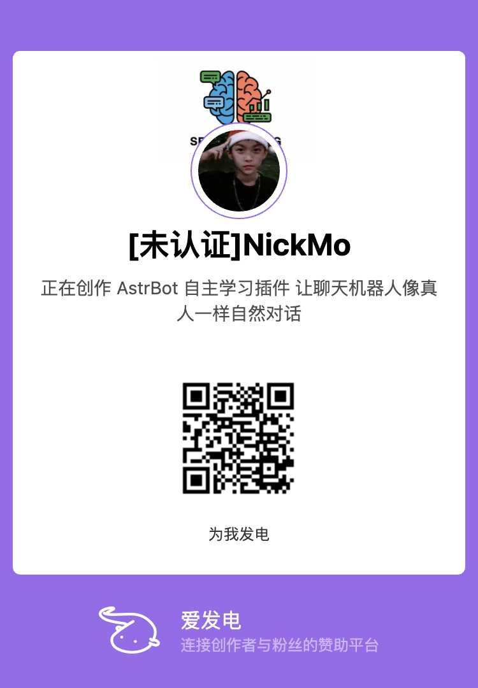

<div align="center">

**[English](README_EN.md)** | **中文**

<br>


<br>

# AstrBot 自主学习插件

**让你的 AI 聊天机器人像真人一样学习、思考和对话**

<br>

[](https://github.com/NickCharlie/astrbot_plugin_self_learning) [](LICENSE) [](https://github.com/Soulter/AstrBot) [](https://www.python.org/)

[核心功能](#-我们能做什么) · [快速开始](#-快速开始) · [管理界面](#-可视化管理界面) · [社区交流](#-社区交流) · [贡献指南](CONTRIBUTING.md)

</div>

<br>

> [!WARNING]
> **使用前必读：请务必先手动备份人格到本地，以防出现 BUG 导致人格混乱**

<details>
<summary><strong>免责声明与用户协议（点击展开）</strong></summary>

<br>

**使用本项目即表示您已阅读、理解并同意以下条款：**

1. **合法使用承诺**
   - 本项目仅供学习、研究和合法用途使用
   - **严禁将本项目直接或间接用于任何违反当地法律法规的用途**
   - 包括但不限于：侵犯隐私、非法采集数据、恶意传播信息、违反平台服务条款等行为

2. **隐私保护责任**
   - 使用者需遵守《中华人民共和国网络安全法》《个人信息保护法》等相关法律法规
   - 在收集和处理用户消息数据时，必须取得用户明确同意
   - 不得将收集的数据用于商业目的或泄露给第三方
   - 建议仅在私有环境或已获得所有参与者同意的群组中使用

3. **使用风险声明**
   - 本项目按"原样"提供，不提供任何明示或暗示的保证
   - 开发者不对使用本项目造成的任何直接或间接损失负责
   - 使用者需自行承担数据丢失、人格错误、系统崩溃等风险
   - **强烈建议在生产环境使用前进行充分测试**

4. **开发者免责**
   - 开发者不对用户的违法违规行为承担任何责任
   - 因用户违规使用导致的法律纠纷，由用户自行承担全部责任
   - 开发者保留随时修改或终止本项目的权利

5. **协议变更**
   - 本协议可能随时更新，恕不另行通知
   - 继续使用本项目即表示接受更新后的协议条款

**重要提示：下载、安装、使用本项目的任何功能，即视为您已完全理解并同意遵守以上所有条款。如不同意，请立即停止使用并删除本项目。**

</details>

---

## 我们能做什么

### 对话风格学习 — 让 Bot 说话像一个真人

你的 Bot 可以自动观察和学习指定用户的说话方式，包括口头禅、表达习惯、语气词，甚至是特殊的标点符号用法。学习是持续进行的，Bot 的表达会随着观察的积累越来越自然，越来越像目标用户。

不只是学单句，而是理解**什么场景下该用什么表达方式**——开心时怎么说、安慰人时怎么说、吐槽时怎么说。

### 社交关系洞察 — 看穿群里谁和谁关系不一般

这是我们最有趣的功能之一。插件能够自动分析群聊中成员之间的社交关系，并生成可视化的关系图谱。

我们可以识别 **22 种关系类型**，包括但不限于：

| 类别 | 可识别的关系 |
|------|------------|
| **日常互动** | 频繁互动、回复对话、话题讨论、问答互动、观点认同、辩论讨论 |
| **社会关系** | 好友/闺蜜、同事/工作伙伴、同学、师生关系 |
| **亲属关系** | 父母子女、兄弟姐妹、亲戚 |
| **亲密关系** | 情侣/恋人、夫妻、**暧昧关系**、**不正当关系** |
| **特殊关系** | 敌对/仇人、竞争对手、崇拜/仰慕、偶像粉丝 |

没错，**暧昧关系和不正当关系也能被识别出来**。通过分析聊天中的称呼、语气、互动频率和亲密程度，插件可以发现那些"不太寻常"的关系。关系图谱中每种关系类型用不同颜色标注，关系强度、互动频次一目了然。

你可以筛选查看某个成员的所有关系，也可以总览整个群的社交网络全貌。

### 自适应人格演化 — Bot 的性格会自己"长大"

传统的 Bot 人格是写死的——你给它设定什么性格，它就永远是那个性格。我们不一样。

本插件会根据学习到的对话风格、群组氛围、用户反馈，**自动生成人格更新建议**。每一次更新都会经过审查机制，你可以在管理界面中对比查看"原来的人格"和"建议修改的部分"，决定是否采纳。

人格不是一次性写好的，而是**持续演化、不断成长**的。

### 群组黑话理解 — 不再闹笑话

每个群都有自己的"方言"。"发财了"可能是表示惊喜，"下次一定"其实是委婉拒绝，某个表情包可能有完全不同于字面的含义。

普通 Bot 遇到这些会一头雾水，甚至闹出笑话。本插件能自动检测和学习群内高频出现的特殊用语，理解它们的真实含义，并在对话中正确使用。**你的 Bot 不会再因为"听不懂黑话"而露馅了。**

### 好感度系统 — 对不同的人有不同的态度

Bot 会记住它和每个用户之间的关系亲疏。经常聊天、友善互动的用户，Bot 会更热情、更愿意分享；而态度恶劣的用户，Bot 的回复也会变得冷淡甚至带刺。

好感度会自然衰减——**不联系就会渐渐疏远**，就像现实中的人际关系一样。每个用户最高 100 分，Bot 的总好感度有上限，不可能对所有人都掏心掏肺。

### 情绪系统 — Bot 也有心情好坏的时候

Bot 不再是一个永远情绪稳定的机器。它会有开心、难过、兴奋、焦虑、顽皮、好奇等情绪状态，情绪会随着时间推移和用户互动自然变化。

心情好的时候回复更积极、更幽默；心情差的时候可能会有点消极或者敷衍。**这让每一次对话都不完全一样，Bot 的表现更加真实。**

### 目标驱动对话 — 不只是接话，而是主动引导

传统 Bot 只会"你说什么我答什么"，被动地接话。本插件的 Bot 能够自动识别用户的对话意图——是需要安慰、想闲聊、在吐槽、还是在求助——并根据识别到的意图**主动引导对话方向**。

支持 38 种对话场景，涵盖情感支持、信息交流、娱乐互动、社交场景、冲突处理等。Bot 会像一个真正的聊天高手一样，知道什么时候该倾听，什么时候该回应，什么时候该转移话题。

### 记忆图谱 — 记住聊过的每一件事

Bot 不再是"金鱼记忆"。它会自动提取对话中的关键信息，构建知识关联网络，形成真正的长期记忆。

上周聊过的话题、你提到过的喜好、你们之间发生过的趣事——Bot 都会记住，并在合适的时候自然地提起。**这种"被记住"的感觉，是让人觉得 Bot 像真人的关键。**

---

## 可视化管理界面

插件自带 macOS 风格的 Web 管理界面（端口 7833），所有功能可视化操作，无需命令行。

**数据统计总览**


**人格管理 & 审查**


**对话风格学习追踪**


**社交关系图谱**


---

## 快速开始

### 安装

```bash
cd /path/to/astrbot/data/plugins
git clone https://github.com/NickCharlie/astrbot_plugin_self_learning.git
```

启动 AstrBot，插件自动加载。

### 访问管理界面

```
http://localhost:7833
```

默认密码：`self_learning_pwd`（首次登录后请立即修改）

### 基础配置

在 AstrBot 后台插件管理中设置以下关键项：

- **学习目标** — 指定要学习的用户 QQ 号（留空则学习所有人）
- **模型配置** — 设置筛选模型和提炼模型的 Provider ID
- **学习频率** — 自动学习间隔（默认 6 小时）
- **数据库** — 支持 SQLite（开箱即用）、MySQL、PostgreSQL

更多配置项可通过 WebUI 系统设置页面调整。

---

## 命令

| 命令 | 说明 |
|------|------|
| `/learning_status` | 查看学习状态和统计 |
| `/start_learning` | 手动启动学习 |
| `/stop_learning` | 停止自动学习 |
| `/force_learning` | 强制执行一次学习 |
| `/affection_status` | 查看好感度排行榜 |
| `/set_mood <类型>` | 设置 Bot 情绪 |

所有命令需要管理员权限。

---

## 推荐搭配

**[群聊增强插件 (Group Chat Plus)](https://github.com/Him666233/astrbot_plugin_group_chat_plus)**

两者完美互补：本插件负责 **学习与人格优化**，群聊增强插件负责 **智能回复决策与读空气能力**。配合使用让 Bot 既能学习，又懂社交。

---

## 社区交流

- QQ 群：**1021544792**（ChatPlus 插件用户 + 本插件用户）
- [提交 Bug](https://github.com/NickCharlie/astrbot_plugin_self_learning/issues)
- [功能建议](https://github.com/NickCharlie/astrbot_plugin_self_learning/issues/new?template=feature_request.md)
- [贡献代码](CONTRIBUTING.md)

---

## 开源协议

本项目采用 [GPLv3 License](LICENSE) 开源协议。

### 特别鸣谢

- **[MaiBot](https://github.com/Mai-with-u/MaiBot)** — 表达模式学习、知识图谱管理等核心设计思路
- **[AstrBot](https://github.com/Soulter/AstrBot)** — 优秀的聊天机器人框架

### 贡献者

<a href="https://github.com/NickCharlie/astrbot_plugin_self_learning/graphs/contributors">
  
</a>

---

---

<div align="center">

**如果觉得有帮助，欢迎 Star 支持！**

### 赞助支持

如果这个项目对你有帮助，欢迎通过爱发电赞助支持开发者持续维护：



[回到顶部](#astrbot-自主学习插件)

</div>
